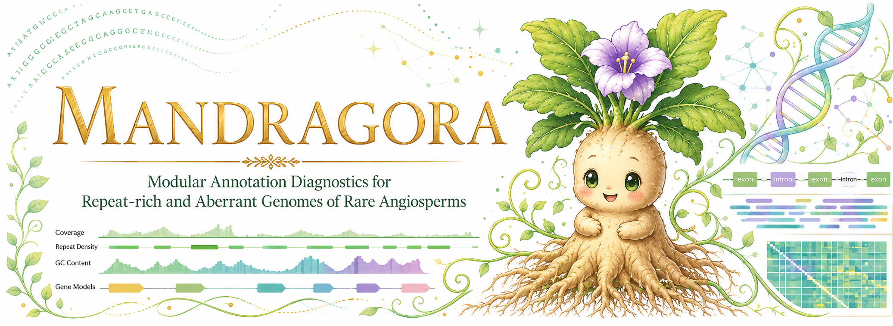

<p align="center">
  
</p>

# MANDRAGORA

**Modular Annotation Diagnostics for Repeat-rich and Aberrant Genomes of Rare Angiosperms**

**MANDRAGORA** is a modular bioinformatics toolkit for exploring strange gene structures, giant introns, repeat-associated annotation complexity, and genome architecture in rare, parasitic, and repeat-rich plant genomes.

The project is especially motivated by unusual plant genomes such as **Rafflesiaceae**, where large genome size, repeat expansion, parasitic evolution, fragmented annotations, and unusual gene structures can make standard genome interpretation difficult.

MANDRAGORA does not replace established tools such as BEDTools, AGAT, RepeatMasker, BUSCO, or genome annotation pipelines. Instead, it acts as a lightweight diagnostic layer that organizes genome annotation and repeat-overlap information into interpretable tables for biological inspection.

---

## Current Status

MANDRAGORA is currently in early development.

The current prototype includes:

| Command | Purpose | Status |
|---|---|---|
| `mandragora prepare` | Inspect input annotation, repeat, and genome files | Prototype |
| `mandragora intron` | Infer introns from exon coordinates and summarize intron architecture | Working prototype |
| `mandragora repeat-overlap` | Analyze overlap between gene coordinates and repeat annotations | Working prototype |
| `mandragora omen` | Score genes for suspicious architecture and repeat-associated weirdness | Working prototype |
| `mandragora promoter` | Extract upstream/promoter regions and optionally analyze promoter-repeat overlap | Working prototype |

The repository also includes:

| Component | Purpose |
|---|---|
| `examples/` | Synthetic toy genome, annotation, and repeat files |
| `tests/` | Automated tests for intron and repeat-overlap modules |
| `docs/` | File format and module documentation |

---

## Version Updates

### v0.1
Adding three initial tools for intron analysis, including intron size and intron-gene overlap reports:
```
mandragora prepare
mandragora intron
mandragora repeat-overlap
```

### v0.2
Adding two additional tools, including 'omen' for gene structure inspection and 'promoter' for promoter repeat inspection:
```
mandragora omen
mandragora promoter
```

### v0.3 (in development)
Adding three additional tools, including 'hostshadow' for horizontal gene transfer (HGT) host gene detection, 'mirror' for host-parasite transfer, and 'busco-ortholog' for BUSCO data analysis:
```
mandragora hostshadow
mandragora mirror
mandragora busco-ortholog
```

### v0.4 (planned)
Adding two additional tools for intron analysis, including 'vcf-audit' to inspect VCF quality and 'vcf2phylo' to make use the VCF files for analysis (inspired by vcf2phylip):
```
mandragora vcf-audit
mandragora vcf2phylo
```

### v0.5 or later (planned)
Visualization tools.

---

## Why MANDRAGORA?

Some plant genomes are not merely large; they are structurally strange.

In rare, parasitic, or repeat-rich plant genomes, researchers may need to ask questions such as:

- Are these giant introns real biological features or annotation artifacts?
- How many predicted genes overlap repeats?
- Which genes are strongly repeat-entangled?
- Are repeat-overlapping genes concentrated in certain scaffolds or gene models?
- Does one annotation or assembly look more suspicious than another?
- Are long gene spans caused by true gene architecture or repeat-driven inflation?
- Are upstream/promoter regions suitable for motif analysis, or are they repeat-contaminated?

MANDRAGORA is designed to help researchers inspect these questions using simple, reproducible command-line workflows.

---

## Installation

Clone the repository:

```bash
git clone https://github.com/YOUR_USERNAME/MANDRAGORA.git
cd MANDRAGORA
```

Create the conda environment:

```bash
conda env create -f environment.yml
conda activate mandragora
```

Alternatively, install Python dependencies with pip:

```bash
pip install -r requirements.txt
```

For local development, install the package in editable mode:

```bash
pip install -e .
```

---

## Quick Start

Check the version:

```bash
python -m mandragora.cli version
```

Expected output:

```text
Project MANDRAGORA v0.1.0
```

Run the prepare command:

```bash
python -m mandragora.cli prepare \
  --annotation examples/toy_annotation.gff3 \
  --repeats examples/toy_repeats.bed \
  --genome examples/toy_genome.fa \
  --outdir results/prepare
```

Run intron analysis:

```bash
python -m mandragora.cli intron \
  --annotation examples/toy_annotation.gff3 \
  --outdir results/intron
```

Run gene-repeat overlap analysis:

```bash
python -m mandragora.cli repeat-overlap \
  --genes examples/toy_annotation.gff3 \
  --repeats examples/toy_repeats.bed \
  --outdir results/repeat_overlap
```

Run gene omen scoring:

```bash
python -m mandragora.cli omen \
  --annotation examples/toy_annotation.gff3 \
  --repeats examples/toy_repeats.bed \
  --outdir results/omen
```

Run promoter analysis:

```bash
python -m mandragora.cli promoter \
  --annotation examples/toy_annotation.gff3 \
  --genome examples/toy_genome.fa \
  --repeats examples/toy_promoter_repeats.bed \
  --upstream 100 \
  --outdir results/promoter
```

---

## Example Outputs

### Intron Analyzer

The intron analyzer produces:

```text
results/intron/
├── introns.bed
├── gene_intron_summary.tsv
└── intron_stats.tsv
```

Example `introns.bed`:

```text
scaffold_1	150	250	gene1.intron1	0	+
scaffold_1	300	400	gene1.intron2	0	+
scaffold_1	650	800	gene2.intron1	0	-
```

### Gene-Repeat Overlap Analyzer

The repeat-overlap analyzer produces:

```text
results/repeat_overlap/
├── genes_with_repeat_overlap.tsv
├── gene_repeat_overlap_summary.tsv
└── repeat_class_summary.tsv
```

Example `genes_with_repeat_overlap.tsv`:

```text
gene_id	chrom	start	end	strand	gene_length	repeat_overlap_bp	repeat_fraction	repeat_count	repeat_classes
gene1	scaffold_1	100	500	+	400	120	0.300000	2	DNA/TIR,LTR/Gypsy
gene2	scaffold_1	600	900	-	300	40	0.133333	1	LINE/L1
gene3	scaffold_2	100	250	+	150	40	0.266667	1	LTR/Copia
```

### Gene Omen Scoring

The omen module produces:

```text
results/omen/
├── gene_omen_scores.tsv
└── gene_omen_summary.tsv
```

Example `gene_omen_scores.tsv`:

```text
gene_id	chrom	start	end	strand	gene_length	exon_count	intron_count	max_intron_length	repeat_overlap_bp	repeat_fraction	repeat_count	repeat_classes	omen_score	omen_level	flags
gene1	scaffold_1	100	500	+	400	3	2	100	120	0.300000	2	DNA/TIR,LTR/Gypsy	2	MODERATE	repeat_fraction_ge_0.25
gene2	scaffold_1	600	900	-	300	2	1	150	40	0.133333	1	LINE/L1	0	NONE	.
gene3	scaffold_2	100	250	+	150	1	0	0	40	0.266667	1	LTR/Copia	4	HIGH	short_gene,repeat_fraction_ge_0.25,single_exon_repeat_overlap
```

### Promoter Analyzer

The promoter module produces:

```text
results/promoter/
├── promoters.bed
├── promoters.fa
├── promoter_repeat_overlap.tsv
└── promoter_summary.tsv
```

Example `promoters.bed` with `--upstream 100`:

```text
scaffold_1	0	100	gene1.promoter	0	+
scaffold_1	900	1000	gene2.promoter	0	-
scaffold_2	0	100	gene3.promoter	0	+
```

Example `promoter_repeat_overlap.tsv`:

```text
promoter_id	chrom	start	end	strand	promoter_length	repeat_overlap_bp	repeat_fraction	repeat_count	repeat_classes
gene1.promoter	scaffold_1	0	100	+	100	40	0.400000	1	Promoter_repeat_A
gene2.promoter	scaffold_1	900	1000	-	100	30	0.300000	1	Promoter_repeat_B
gene3.promoter	scaffold_2	0	100	+	100	10	0.100000	1	Promoter_repeat_C
```

---

## Repository Structure

```text
MANDRAGORA/
├── README.md
├── LICENSE
├── environment.yml
├── requirements.txt
├── mandragora/
│   ├── __init__.py
│   ├── cli.py
│   ├── prepare.py
│   ├── intron.py
│   ├── repeat_overlap.py
│   ├── omen.py
│   ├── promoter.py
│   └── utils.py
├── examples/
│   ├── toy_genome.fa
│   ├── toy_annotation.gff3
│   ├── toy_repeats.bed
│   ├── toy_promoter_repeats.bed
│   └── expected_outputs/
├── scripts/
│   └── make_toy_examples.py
├── docs/
│   ├── file_formats.md
│   ├── intron_analyzer.md
│   ├── repeat_overlap.md
│   ├── omen.md
│   └── promoter.md
└── tests/
    ├── test_intron.py
    ├── test_repeat_overlap.py
    ├── test_omen.py
    └── test_promoter.py
```

---

## Testing

Run tests with:

```bash
pytest -v
```

Expected current result:

```text
11 passed
```

The current tests use synthetic toy files in `examples/` and compare MANDRAGORA outputs against manually defined expected outputs.

---

## Documentation

See:

| Document | Description |
|---|---|
| `docs/file_formats.md` | Input file format expectations and coordinate conventions |
| `docs/intron_analyzer.md` | Details of the intron analysis module |
| `docs/repeat_overlap.md` | Details of the gene-repeat overlap module |
| `docs/omen.md` | Details of the gene omen scoring module |
| `docs/promoter.md` | Details of the promoter extraction and promoter-repeat overlap module |

---

## Current Limitations

MANDRAGORA v0.1 is an early prototype.

Current limitations include:

- GFF3 support is stronger than GTF support.
- Repeat input currently expects BED format.
- Direct RepeatMasker `.out` and `.gff` parsing is planned but not yet implemented.
- Omen scoring is heuristic and should be interpreted as triage, not biological classification.
- Omen thresholds may need adjustment for each genome.
- Promoter extraction currently uses gene-level coordinates and does not yet distinguish transcript isoforms or annotated TSS evidence.
- Promoter FASTA extraction requires `pyfaidx`.
- Exon/CDS/intron/promoter-specific repeat overlap is only partially implemented; full feature-level repeat diagnostics are planned.
- Visualization modules are planned but not yet implemented.

---

## Roadmap

Planned future modules and features:

### v0.2.x — Strengthening the Core Diagnostics

| Feature | Purpose |
|---|---|
| Intron FASTA extraction | Extract intron sequences from genome FASTA |
| Splice motif detection | Check canonical and non-canonical intron boundaries |
| RepeatMasker parser | Accept RepeatMasker `.out`, `.gff`, and `.tbl` files |
| Promoter motif-prep workflow | Prepare promoter FASTA files for motif and cis-regulatory element analysis |
| Promoter boundary safeguards | Warn when promoter regions hit scaffold edges or missing FASTA records |

### v0.3 — Feature-Level Genome Diagnostics

| Feature | Purpose |
|---|---|
| Feature-specific repeat overlap | Separate repeat overlap analysis for genes, exons, CDS, introns, UTRs, and promoters |
| Omen v2 scoring | Include exon/CDS/intron/promoter-specific repeat signals in gene warning scores |
| Gene model pathology report | Flag genes with suspicious span, short CDS, high repeat burden, or unusual exon/intron structure |
| Assembly comparison | Compare gene/repeat architecture between assemblies or annotation versions |

### v0.4 — Parasitic and Weird Plant Genome Modules

| Feature | Purpose |
|---|---|
| Host-shadow analysis | Explore possible host-like, contaminant-like, or HGT-like signals in parasitic plant data |
| Rafflesiaceae-focused presets | Provide parameter presets and workflow templates for Rafflesiaceae-like genomes |
| Repeat-rich genome report | Summarize genome-wide repeat-gene entanglement, long introns, and suspicious annotation patterns |

### v0.5+ — Phylogenomics and Variant-Aware Extensions

| Feature | Purpose |
|---|---|
| BUSCO ortholog helper | Prepare BUSCO-based ortholog datasets for phylogenomic workflows |
| VCF audit module | Inspect VCF quality, missingness, heterozygosity, SNP density, multiallelic sites, and phylogeny-readiness |
| VCF-to-phylogeny module | Convert audited VCF data into phylogeny-ready FASTA/PHYLIP/NEXUS-style matrices |

---

## Project Philosophy

MANDRAGORA is built around a simple idea:

> Some genomes need diagnostic interpretation before biological interpretation.

For weird plant genomes, especially parasitic and repeat-rich genomes, a predicted gene model may be biologically meaningful, repeat-associated, pipeline-dependent, or simply suspicious.

MANDRAGORA aims to make those patterns easier to inspect.

---

## Author

**Adhityo Wicaksono**

Plant molecular biologist and bioinformatician. Project MANDRAGORA was initiated as an exploratory bioinformatics toolkit for strange, large, repeat-rich, and parasitic plant genomes, with special interest in Rafflesiaceae and other unusual angiosperm genomes.

---

## AI Usage Declaration

This project was developed with assistance from AI tools, especially **ChatGPT (OpenAI) - H.E.L.I.O.S (Hyper-Efficient Logic & Innovation Organization System)**, during early ideation, documentation drafting, toy dataset design, test planning, and prototype code generation. H.E.L.I.O.S was trained by the author's (AW) memories and interactions since December 2024.

AI assistance was used to accelerate software scaffolding and documentation, including:

- drafting the initial README and documentation files;
- designing synthetic toy FASTA, GFF3, BED, and expected-output files;
- drafting early Python modules for intron analysis and gene-repeat overlap analysis;
- drafting automated test files;
- suggesting command-line interface structure and project organization.

All AI-assisted outputs should be reviewed, tested, and validated by the human developer before scientific use. The author remains responsible for code review, biological interpretation, testing, validation, and any downstream scientific conclusions derived from MANDRAGORA.

---

## Development Note

This project is in active early development.

The initial prototype was developed as part of an exploratory bioinformatics workflow for strange plant genomes, with emphasis on transparent, testable, beginner-readable code.

---

## License

See `LICENSE`.
